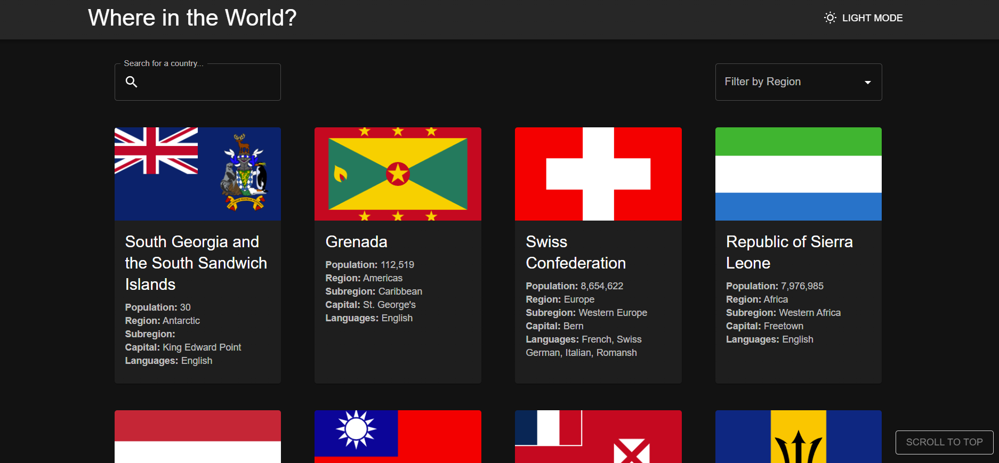

# 🌍 REST Countries Explorer

A responsive web application built with **React**, **TypeScript**, and **Material-UI** that integrates with the [REST Countries API](https://restcountries.com) to display and explore country data from around the world.

---

## 📸 Preview



---

## 🔗 Links

- 💻 **Repository:** [https://github.com/An301290/world-country-guide](#)

---

## ✨ Features

- 🗺️ **Browse all countries** — View all countries from the REST Countries API on the homepage with flag, population, region, and capital info
- 🔍 **Search** — Filter countries in real time using the search input
- 🌎 **Filter by Region** — Narrow down results by Africa, Americas, Asia, Europe, or Oceania
- 📄 **Country Detail Page** — Click any country to see in-depth information including currencies, languages, and border countries
- 🔗 **Border Navigation** — Click through to any of a country's bordering countries directly from the detail page
- 📱 **Fully Responsive** — Optimized layout for mobile, tablet, and desktop screen sizes
- 🌙 **Dark / Light Mode** — Toggle between color themes with persistent preference

---

## 🛠️ Built With

| Technology                                    | Purpose                                 |
| --------------------------------------------- | --------------------------------------- |
| [React 18](https://reactjs.org/)              | UI component library                    |
| [TypeScript](https://www.typescriptlang.org/) | Static typing and improved DX           |
| [Material-UI (MUI)](https://mui.com/)         | Component library and theming           |
| [Axios](https://axios-http.com/)              | HTTP requests to the REST Countries API |
| [React Router](https://reactrouter.com/)      | Client-side routing                     |

---

## 🚀 Getting Started

### Prerequisites

- Node.js `>=16.x`
- npm or yarn

### Installation

1. **Clone the repository**

   ```bash
   git clone https://github.com/An301290/world-country-guide
   cd world-country-guide
   ```

2. **Install dependencies**

   ```bash
   npm install
   # or
   yarn install
   ```

3. **Start the development server**

   ```bash
   npm start
   # or
   yarn start
   ```

4. Open [http://localhost:3000](http://localhost:3000) in your browser.

---

## 🎨 Design Decisions

- **MUI theming** — Used MUI's `createTheme` with a custom palette for both light and dark modes, keeping the design consistent with the Frontend Mentor spec
- **TypeScript interfaces** — Typed all API response data for a safer, more predictable codebase
- **Axios service layer** — Separated all API logic into a dedicated service module to keep components clean
- **Context API** — Used React Context to manage and persist the dark/light theme preference across the app

---

## 🧠 What I Learned

- Integrating a third-party REST API with **Axios** and handling loading/error states gracefully
- Building a scalable **MUI theme** that supports both light and dark modes via a custom `ThemeProvider`
- Using **TypeScript generics** to type Axios responses and component props for better developer experience
- Structuring a React app with **separation of concerns** — services, hooks, types, and UI components kept independent
- Implementing **React Router** for navigation between the homepage and country detail pages

---

## 🙏 Acknowledgements

- Challenge by [Frontend Mentor](https://www.frontendmentor.io/challenges/rest-countries-api-with-color-theme-switcher-5cacc469fec04111f7b848ca)
- Country data from [REST Countries API](https://restcountries.com)
- Icons via [Material Icons](https://mui.com/material-ui/material-icons/)

---

## 📝 License

This project is open source and available under the [MIT License](./LICENSE).
